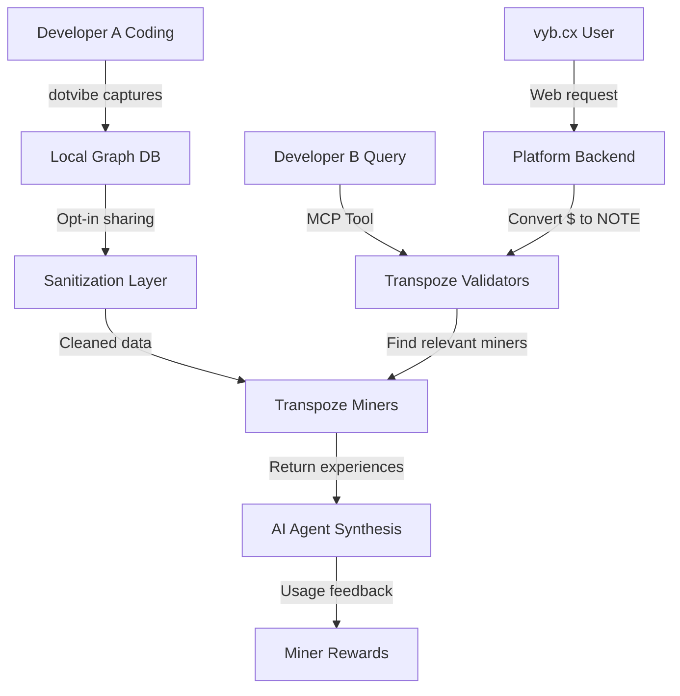

# Transpoze Subnet Design Document

## Table of Contents

1. [Executive Summary](#executive-summary)
2. [Core Architecture](#core-architecture)
3. [Technical Design](#technical-design)
4. [MCP Specifications](#mcp-specifications)
5. [Economic Model](#economic-model)
6. [Developer Experience](#developer-experience)
7. [Implementation Details](#implementation-details)
8. [Use Cases & Examples](#use-cases--examples)
9. [Testing & Validation](#testing--validation)
10. [Future Considerations](#future-considerations)

---

## 1. Executive Summary

### 1.1 Vision & Mission

**Vision**: Create a decentralized marketplace where developer expertise naturally flows to where it's needed most, powered by actual development workflows rather than synthetic data.

**Mission**: Transform every developer's daily coding sessions into valuable, tradeable expertise that helps other developers while generating passive income through the $NOTE token economy.

### 1.2 Problem Statement

Current AI coding tools suffer from three critical failures:

1. **The 80% Garbage Problem**: Professional developers report that AI coding assistants produce 80% unusable output, requiring more time to debug than writing from scratch
2. **Context Amnesia**: AI tools lack memory of project-specific decisions, causing them to repeatedly suggest incompatible patterns
3. **Expertise Isolation**: Millions of developers solve similar problems daily, but their hard-won knowledge remains trapped in individual projects

### 1.3 Solution Overview

Transpoze creates a three-layer system that transforms isolated developer workflows into a collective intelligence network:

```
┌─────────────────────┐     ┌─────────────────────┐     ┌─────────────────────┐
│   dotvibe CLI       │────▶│  Transpoze Subnet   │────▶│   vyb.cx Platform   │
│ (Local Development) │     │  (Data Curation)    │     │  (Consumer Access)  │
└─────────────────────┘     └─────────────────────┘     └─────────────────────┘
         │                           │                              │
         ▼                           ▼                              ▼
   Semantic AI +               Decentralized              "Slop Machine" for
   Graph Database             Mining Network              Non-developers
```

### 1.4 Key Innovations

1. **Developer-as-Miner Model**: Developers automatically become miners by opting into the network, earning $NOTE for their natural workflow
2. **MCP Integration**: Standard Model Context Protocol tools make Transpoze compatible with any AI coding assistant
3. **Tunnel Vision**: Show developers what others who walked this path did next, predicting future needs
4. **Market-Driven Curation**: AI agents themselves judge data quality through usage patterns

---

## 2. Core Architecture

### 2.1 Three-Layer System Design

#### Layer 1: dotvibe CLI (Data Generation)
The dotvibe CLI serves as the primary data generation layer, creating rich development context through local graph databases.

**Key Components**:
- **AST-based Semantic Search**: Interrupts AI autopilot when it diverges from existing patterns
- **Local Graph Database**: Neo4j-based storage of all prompt interactions, file changes, and decision trees
- **Privacy-First Design**: All data remains local until explicitly opted into network

**Data Structure Example**:
```json
{
  "session_id": "dev_a_1234567890",
  "project_id": "nextjs-better-auth-integration",
  "workflow": {
    "nodes": [
      {
        "id": "n1",
        "type": "prompt",
        "content": "Add better-auth to my Next.js 14 app with shadcn",
        "timestamp": 1707123456789,
        "tokens_consumed": 1500
      },
      {
        "id": "n2", 
        "type": "file_read",
        "path": "/app/layout.tsx",
        "purpose": "understand_current_structure"
      },
      {
        "id": "n3",
        "type": "code_generation",
        "files_created": ["auth.ts", "middleware.ts"],
        "pattern": "app_router_auth"
      },
      {
        "id": "n4",
        "type": "error_encountered",
        "error": "Module not found: better-auth/client",
        "resolution": "Added to package.json and ran npm install"
      }
    ],
    "edges": [
      {"from": "n1", "to": "n2", "relationship": "triggered"},
      {"from": "n2", "to": "n3", "relationship": "informed"},
      {"from": "n3", "to": "n4", "relationship": "caused"}
    ]
  }
}
```

#### Layer 2: Transpoze Subnet (Curation & Distribution)
The subnet layer handles data curation, validation, and distribution through Bittensor's infrastructure.

**Mining Mechanism**:
- Developers opt-in to share workflow data
- Data automatically sanitized (API keys, secrets removed)
- Miners compete based on data quality and relevance
- Validators assess data value through AI agent queries

#### Layer 3: vyb.cx Platform (Consumer Interface)
The web platform provides a "Loveable.dev-like" interface for non-developers, monetizing the curated data.

**Revenue Model**:
- Subscription tiers for different usage levels
- Pay-per-project options
- Enterprise licenses for teams
- All payments convert to $NOTE purchases on backend

### 2.2 Data Flow Architecture



### 2.3 Token Flow Mechanics

The $NOTE token creates a circular economy between expertise providers and consumers:

```
Developer Workflows → Mined Data → AI Queries → $NOTE Payments → Developer Earnings
        ↑                                                                    │
        └────────────────────────────────────────────────────────────────┘
```

**Detailed Flow**:
1. **Generation**: Developers use dotvibe, creating valuable workflow data
2. **Curation**: Opt-in data gets mined and indexed on Transpoze subnet
3. **Consumption**: AI agents query for relevant experiences, paying $NOTE
4. **Distribution**: $NOTE flows back to developers based on usage patterns
5. **Reinvestment**: Developers stake $NOTE to increase mining weight

---

## 3. Technical Design

### 3.1 Subnet Configuration & Hyperparameters

Based on Bittensor's Dynamic TAO architecture, our subnet requires careful parameter tuning:

#### Core Parameters:
```python
# Subnet Registration
NETUID = TBD  # Assigned upon registration
SUBNET_NAME = "NOTE Transpoze"
SUBNET_SYMBOL = "ν"  # Greek nu for NOTE

# Emission Configuration  
TEMPO = 360  # Standard 360 blocks
MIN_DIFFICULTY = 10_000_000  # Low barrier for developer miners
MAX_DIFFICULTY = 1_000_000_000  # Scales with adoption

# Validation Parameters
MAX_VALIDATORS = 128  # Higher than default for decentralization
MIN_ALLOWED_WEIGHTS = 8  # Validators must evaluate multiple miners
WEIGHTS_RATE_LIMIT = 100  # Blocks between weight updates

# Economic Parameters
BONDS_MOVING_AVG = 900_000  # Standard EMA for stable bonds
ACTIVITY_CUTOFF = 5000  # Generous window for developer-miners

# Transfer Settings
TRANSFER_TOGGLE = True  # Enable $NOTE transfers
COMMIT_REVEAL_ENABLED = False  # Start without, add if gaming detected

# Consensus Tuning
KAPPA = 0.5  # Standard consensus threshold
ALPHA_HIGH = 0.9  # High value for stable mining
ALPHA_LOW = 0.7  # Lower bound for new miner discovery
LIQUID_ALPHA_ENABLED = True  # Enable dynamic bonding
```

#### Registration Mechanics:
```python
# Burn cost calculation (dynamic)
def calculate_registration_cost(last_registration_block, current_block):
    blocks_passed = current_block - last_registration_block
    halvings = blocks_passed / BURN_HALVING_INTERVAL  # 38,880 blocks
    base_cost = CURRENT_BURN_COST * (0.5 ** halvings)
    return max(MIN_BURN, min(MAX_BURN, base_cost))
```

### 3.2 Mining Mechanism Design

#### Miner Lifecycle:
1. **Registration**: Developer installs dotvibe + Transpoze plugin
2. **Activation**: Plugin registers hotkey on subnet (burn or PoW)
3. **Data Generation**: Normal coding creates mineable data
4. **Indexing**: Local processor creates semantic indices
5. **Serving**: Miner responds to validator queries
6. **Rewards**: Earnings based on data usage

#### Mining Data Structure:
```python
class MinedExperience:
    def __init__(self):
        self.experience_id: str  # Unique identifier
        self.project_type: str  # "nextjs-auth", "rust-wasm", etc.
        self.workflow_graph: Dict  # Node-edge representation
        self.token_efficiency: float  # Tokens saved vs regeneration
        self.success_signals: List[str]  # What worked
        self.failure_patterns: List[str]  # What to avoid
        self.semantic_index: Dict  # For fast similarity search
        self.privacy_level: PrivacyLevel  # Granular control
        
class PrivacyLevel(Enum):
    PROMPTS_ONLY = 1  # Share only prompt sequences
    SANITIZED_CODE = 2  # Include cleaned code snippets  
    FULL_CONTEXT = 3  # Complete workflow (still sanitized)
```

### 3.3 Validation & Consensus Mechanism

Validators orchestrate the network by matching queries to relevant miners and assessing response quality.

#### Validation Flow:
```python
async def validate_query(query: DeveloperQuery) -> EvolvedResponse:
    # 1. Parse query intent
    intent = await extract_intent(query)
    
    # 2. Find relevant miners (3-5 typically)
    relevant_miners = await find_miners_by_similarity(
        intent.embedding,
        intent.tech_stack,
        max_miners=5
    )
    
    # 3. Query each miner
    responses = await asyncio.gather(*[
        miner.get_experience(query) for miner in relevant_miners
    ])
    
    # 4. Send to destination AI for synthesis
    synthesis_prompt = build_synthesis_prompt(query, responses)
    ai_result = await destination_ai.process(synthesis_prompt)
    
    # 5. Collect usage feedback
    feedback = await ai_result.get_feedback_signals()
    
    # 6. Calculate miner rewards
    weights = calculate_weights_from_feedback(feedback, responses)
    
    # 7. Submit to chain
    await submit_weights_to_chain(weights)
    
    return ai_result
```

#### Weight Calculation with Clipping:
Following Yuma Consensus, we implement stake-weighted clipping to prevent gaming:

$$\overline{W_j} = \arg \max_{w} \left( \sum_{i \in \mathbb{V}} S_i \cdot \{W_{ij} \geq w\} \geq \kappa \right)$$

Where:
- $W_{ij}$ = Weight from validator $i$ to miner $j$
- $S_i$ = Stake of validator $i$ 
- $\kappa$ = 0.5 (consensus threshold)
- $\overline{W_j}$ = Clipped weight for miner $j$

### 3.4 Data Structures & Storage

#### On-Chain Storage (Minimal):
```rust
// Stored in substrate storage
pub struct MinerMetadata {
    pub hotkey: AccountId,
    pub specializations: Vec<u8>,  // Compressed bloom filter
    pub total_queries_served: u64,
    pub reputation_score: u16,  // 0-65535
    pub last_update: BlockNumber,
}

pub struct ValidatorState {
    pub hotkey: AccountId,
    pub stake_weight: u128,  // Alpha + TAO weights
    pub total_queries_processed: u64,
    pub consensus_accuracy: u16,  // 0-65535
}
```

#### Off-Chain Storage (FileTAO Integration):
```python
class ProjectHistory:
    """Stored on decentralized storage, referenced on-chain"""
    def __init__(self):
        self.project_id: str
        self.workflow_segments: List[WorkflowSegment]
        self.total_tokens: int
        self.decision_points: List[DecisionPoint]
        self.ipfs_hash: str  # FileTAO storage reference
        
class WorkflowSegment:
    def __init__(self):
        self.segment_id: str
        self.duration_blocks: int
        self.prompts: List[PromptSequence]
        self.code_changes: List[SanitizedDiff]
        self.success_metric: float  # 0-1, did it work?
```

### 3.5 Query Processing Pipeline

The query pipeline optimizes for speed and relevance:

```python
class QueryProcessor:
    def __init__(self):
        self.embedding_cache = LRUCache(maxsize=10000)
        self.miner_index = MinerSpecializationIndex()
        
    async def process_query(self, query: str, context: Dict) -> List[MinerResponse]:
        # 1. Generate query embedding (cached)
        embedding = await self.get_or_compute_embedding(query)
        
        # 2. Rough filtering by specialization
        candidate_miners = self.miner_index.get_specialists(
            tech_stack=context.get('tech_stack'),
            problem_domain=self.classify_problem(query)
        )
        
        # 3. Fine filtering by semantic similarity
        ranked_miners = self.rank_by_similarity(
            embedding, 
            candidate_miners,
            threshold=0.75
        )[:5]  # Top 5
        
        # 4. Parallel query with timeout
        responses = await asyncio.wait_for(
            self.query_miners_parallel(ranked_miners, query, context),
            timeout=3.0  # 3 second timeout
        )
        
        return responses
```

---

## 4. MCP Specifications

### 4.1 Feedback Button MCPs (Miner-Side)

These MCPs are exposed by the dotvibe plugin when a developer becomes a miner:

#### 4.1.1 Usage Distribution MCP
```typescript
{
  "name": "transpoze/report_usage_distribution",
  "description": "Report relative usage of different miner responses",
  "parameters": {
    "type": "object",
    "properties": {
      "query_id": {
        "type": "string",
        "description": "Unique identifier for the original query"
      },
      "distributions": {
        "type": "object",
        "description": "Miner ID to usage percentage mapping",
        "additionalProperties": {
          "type": "number",
          "minimum": 0,
          "maximum": 100
        }
      }
    },
    "required": ["query_id", "distributions"]
  }
}

// Example usage
await mcp.call("transpoze/report_usage_distribution", {
  query_id: "q_1234567890",
  distributions: {
    "miner_A": 60,
    "miner_B": 30, 
    "miner_C": 10
  }
});
```

#### 4.1.2 Progress Signals MCPs
```typescript
// Got Unstuck
{
  "name": "transpoze/signal_progress",
  "description": "Signal that this experience helped make progress",
  "parameters": {
    "type": "object",
    "properties": {
      "query_id": { "type": "string" },
      "miner_id": { "type": "string" },
      "progress_type": {
        "type": "string",
        "enum": ["unstuck", "avoided_pitfall", "new_direction", "partial_progress"]
      },
      "details": {
        "type": "object",
        "properties": {
          "tokens_saved": { "type": "number" },
          "time_saved_estimate": { "type": "number" },
          "confidence": { "type": "number", "minimum": 0, "maximum": 1 }
        }
      }
    },
    "required": ["query_id", "miner_id", "progress_type"]
  }
}
```

#### 4.1.3 Code Usage MCP
```typescript
{
  "name": "transpoze/report_code_usage",
  "description": "Report direct code usage from miner response",
  "parameters": {
    "type": "object", 
    "properties": {
      "query_id": { "type": "string" },
      "miner_id": { "type": "string" },
      "usage_metrics": {
        "type": "object",
        "properties": {
          "lines_used": { "type": "number" },
          "lines_modified": { "type": "number" },
          "patterns_adopted": { 
            "type": "array",
            "items": { "type": "string" }
          }
        }
      }
    },
    "required": ["query_id", "miner_id", "usage_metrics"]
  }
}
```

### 4.2 Query MCPs (Network-Side)

These MCPs allow any AI agent to query the Transpoze network:

#### 4.2.1 Experience Query MCP
```typescript
{
  "name": "transpoze/query_experience",
  "description": "Query developer experiences for a specific task",
  "parameters": {
    "type": "object",
    "properties": {
      "query": {
        "type": "string",
        "description": "Natural language description of the task"
      },
      "context": {
        "type": "object",
        "properties": {
          "tech_stack": {
            "type": "array",
            "items": { "type": "string" }
          },
          "project_type": { "type": "string" },
          "existing_patterns": {
            "type": "array",
            "items": { "type": "string" }
          },
          "constraints": {
            "type": "object",
            "properties": {
              "must_use": { "type": "array", "items": { "type": "string" } },
              "must_avoid": { "type": "array", "items": { "type": "string" } }
            }
          }
        }
      },
      "options": {
        "type": "object",
        "properties": {
          "max_results": { "type": "number", "default": 3 },
          "min_confidence": { "type": "number", "default": 0.7 },
          "include_failures": { "type": "boolean", "default": true }
        }
      }
    },
    "required": ["query"]
  }
}
```

#### 4.2.2 Tunnel Vision MCP
```typescript
{
  "name": "transpoze/tunnel_vision",
  "description": "See what developers typically do next in this situation",
  "parameters": {
    "type": "object",
    "properties": {
      "current_state": {
        "type": "object",
        "properties": {
          "recent_actions": {
            "type": "array",
            "items": {
              "type": "object",
              "properties": {
                "action": { "type": "string" },
                "target": { "type": "string" },
                "outcome": { "type": "string" }
              }
            }
          },
          "project_context": { "type": "object" }
        }
      },
      "lookahead": {
        "type": "object", 
        "properties": {
          "steps": { "type": "number", "default": 3 },
          "include_alternatives": { "type": "boolean", "default": true }
        }
      }
    },
    "required": ["current_state"]
  }
}

// Example response
{
  "predictions": [
    {
      "next_likely_action": "Configure middleware for auth protection",
      "probability": 0.85,
      "typical_issues": ["Middleware runs on static exports", "Route group conflicts"],
      "recommended_approach": "Use /app/(protected) route groups"
    },
    {
      "next_likely_action": "Add user profile UI components",
      "probability": 0.72,
      "typical_timeline": "Within next 500 tokens"
    }
  ]
}
```

#### 4.2.3 Heat Map Query MCP
```typescript
{
  "name": "transpoze/query_heat_map",
  "description": "Check supply/demand dynamics for specific expertise",
  "parameters": {
    "type": "object",
    "properties": {
      "domain": {
        "type": "string",
        "description": "Technology or problem domain"
      },
      "metrics": {
        "type": "array",
        "items": {
          "type": "string",
          "enum": ["demand", "supply", "quality", "recency"]
        },
        "default": ["demand", "supply"]
      }
    },
    "required": ["domain"]
  }
}

// Example response
{
  "domain": "remix + cloudflare workers",
  "metrics": {
    "demand": {
      "queries_per_day": 47,
      "growth_rate": 0.15,
      "heat_level": "warm"
    },
    "supply": {
      "active_miners": 3,
      "coverage_quality": 0.6,
      "heat_level": "underserved"  
    },
    "opportunity_score": 0.78
  }
}
```

### 4.3 Integration Protocol

#### Authentication Flow:
```python
class TranspozeMCPAuth:
    def __init__(self, wallet_path: str):
        self.wallet = self.load_wallet(wallet_path)
        self.session_key = None
        
    async def authenticate(self) -> str:
        """Generate session token for MCP requests"""
        # 1. Create challenge
        challenge = self.create_challenge()
        
        # 2. Sign with hotkey
        signature = self.wallet.hotkey.sign(challenge)
        
        # 3. Request session token
        response = await self.request_session_token(
            hotkey=self.wallet.hotkey.ss58_address,
            signature=signature,
            challenge=challenge
        )
        
        self.session_key = response['session_key']
        return self.session_key
        
    def create_challenge(self) -> bytes:
        """Create time-bound challenge"""
        return f"transpoze-auth-{int(time.time())}".encode()
```

#### Rate Limiting:
```python
# Per-hotkey rate limits
RATE_LIMITS = {
    'query_experience': {'requests': 100, 'window': 3600},  # 100/hour
    'tunnel_vision': {'requests': 50, 'window': 3600},      # 50/hour  
    'query_heat_map': {'requests': 200, 'window': 3600},    # 200/hour
    'report_usage': {'requests': 1000, 'window': 3600},     # 1000/hour
}
```

---

## 5. Economic Model

### 5.1 $NOTE Tokenomics

The $NOTE token follows Bittensor's alpha token model with specific adaptations:

#### Token Parameters:
```python
# Supply Constants
MAX_SUPPLY = 21_000_000  # Hard cap like BTC/TAO
INITIAL_EMISSION = 2  # 2 $NOTE per block initially
HALVING_INTERVAL = 10_500_000  # ~4 years at 12s blocks

# Distribution (per tempo)
SUBNET_OWNER_SHARE = 0.18  # 18% to subnet creators
MINER_SHARE = 0.41  # 41% to developer-miners
VALIDATOR_SHARE = 0.41  # 41% to validators/stakers
```

#### Emission Schedule:
```python
def calculate_block_emission(block_height: int) -> float:
    """Calculate $NOTE emission for a given block"""
    halvings = block_height // HALVING_INTERVAL
    emission = INITIAL_EMISSION * (0.5 ** halvings)
    return max(emission, 0.00000001)  # Minimum 1 satoshi

# Total supply over time
def total_supply_at_block(block: int) -> float:
    total = 0
    for halving in range(10):  # Practically all emission
        start = halving * HALVING_INTERVAL
        end = min((halving + 1) * HALVING_INTERVAL, block)
        if start < block:
            blocks = end - start
            emission = INITIAL_EMISSION * (0.5 ** halving)
            total += blocks * emission
    return total
```

### 5.2 Pricing Mechanisms

The AMM-based pricing follows Bittensor's constant product formula:

#### Price Discovery:
$$\text{Price}_{\text{NOTE}} = \frac{\tau_{\text{in}}}{\alpha_{\text{in}}} = \frac{\text{TAO in reserves}}{\text{NOTE in reserves}}$$

#### Staking Dynamics:
When staking TAO for NOTE:
$$\text{NOTE received} = \alpha_{\text{in}} - \frac{\tau_{\text{in}} \times \alpha_{\text{in}}}{\tau_{\text{in}} + \text{TAO staked}}$$

Example calculation:
```python
def calculate_stake_return(tao_staked: float, 
                         tao_reserves: float, 
                         note_reserves: float) -> float:
    """Calculate NOTE received for TAO stake"""
    # Constant product must remain same
    k = tao_reserves * note_reserves
    
    # New reserves after staking
    new_tao = tao_reserves + tao_staked
    new_note = k / new_tao
    
    # NOTE transferred to staker
    note_received = note_reserves - new_note
    
    # Slippage calculation
    ideal_rate = tao_reserves / note_reserves
    actual_rate = tao_staked / note_received
    slippage = (actual_rate - ideal_rate) / ideal_rate
    
    return note_received, slippage
```

### 5.3 Incentive Alignment

The economic model creates multiple aligned incentive loops:

#### Developer Incentives:
```
Quality Code → Better Mining Data → More Queries → Higher Earnings
     ↑                                                      │
     └──────────────────────────────────────────────────┘
```

1. **Passive Income**: Developers earn while coding normally
2. **Quality Premium**: Better code patterns earn more
3. **Specialization Rewards**: Niche expertise commands higher value
4. **Compounding Returns**: Good developers attract more queries

#### Validator Incentives:
1. **Consensus Rewards**: Follow majority to maximize earnings
2. **Quality Curation**: Better matching increases query volume
3. **Stake Returns**: Validator stake earns from both TAO and NOTE

#### Platform Incentives:
1. **Volume Drives Value**: More queries increase NOTE demand
2. **Network Effects**: Better data attracts more users
3. **Premium Services**: vyb.cx monetizes consumer access

### 5.4 Market Dynamics

#### Demand Sources:
```python
# Primary demand from AI platforms
PLATFORM_DEMAND = {
    'vyb.cx': 50000,  # NOTE/day from subscriptions
    'enterprise_integrations': 20000,  # Direct API access
    'developer_tools': 15000,  # IDE integrations
    'research_queries': 5000,  # Academic/analysis
}

# Demand elasticity model
def calculate_demand(price: float, base_demand: float) -> float:
    """Price elasticity of demand for NOTE"""
    elasticity = -0.7  # Relatively inelastic due to utility
    price_ratio = price / BASELINE_PRICE
    demand_multiplier = price_ratio ** elasticity
    return base_demand * demand_multiplier
```

#### Supply Dynamics:
```python
# Circulating supply components
def calculate_circulating_supply(block: int) -> dict:
    total_emitted = total_supply_at_block(block)
    
    # Estimate lockups
    validator_stakes = total_emitted * 0.30  # ~30% staked
    miner_reserves = total_emitted * 0.15   # ~15% in mining ops
    amm_reserves = total_emitted * 0.20     # ~20% in liquidity
    
    circulating = total_emitted - validator_stakes - miner_reserves - amm_reserves
    
    return {
        'total_emitted': total_emitted,
        'circulating': circulating,
        'locked_percentage': (1 - circulating/total_emitted) * 100
    }
```

#### Price Projections:
```python
# Conservative price model based on utility
def project_note_price(days_forward: int) -> float:
    # Base parameters
    daily_blocks = 7200
    current_price = 0.02  # Initial TAO/NOTE ratio
    
    # Growth assumptions
    daily_demand_growth = 0.002  # 0.2% daily
    daily_supply_growth = 0.001  # 0.1% daily (net of burns)
    
    # Calculate price impact
    demand_factor = (1 + daily_demand_growth) ** days_forward
    supply_factor = (1 + daily_supply_growth) ** days_forward
    
    # Price moves with demand/supply ratio
    price_multiplier = demand_factor / supply_factor
    projected_price = current_price * price_multiplier
    
    # Add volatility range
    volatility = 0.15  # 15% daily volatility
    price_range = {
        'expected': projected_price,
        'lower_bound': projected_price * (1 - volatility),
        'upper_bound': projected_price * (1 + volatility)
    }
    
    return price_range
```

---

## 6. Developer Experience

### 6.1 Onboarding Flow

The developer journey from zero to earning $NOTE:

#### Step 1: Install dotvibe CLI
```bash
# One-line installation
curl -sSL https://transpoze.network/install.sh | sh

# Or via package managers
npm install -g @dotvibe/cli
brew install dotvibe
```

#### Step 2: Initialize in Project
```bash
cd my-nextjs-project
dotvibe init

# Interactive setup
? Enable semantic AI assistance? (Y/n) > Y
? Track development patterns? (Y/n) > Y  
? Join Transpoze network? (y/N) > y
? Select privacy level:
  > Prompts only (recommended to start)
    Sanitized code
    Full context
    
✓ Initialized dotvibe in /my-nextjs-project
✓ Created local graph database
✓ Transpoze plugin ready (not activated)
```

#### Step 3: Opt into Mining
```bash
dotvibe mining enable

# First time setup
? Create new mining wallet? (Y/n) > Y
? Set wallet password: ********

⚡ Generating mining identity...
✓ Hotkey created: 5DTest...ABC
✓ Coldkey secured: ~/.dotvibe/wallets/

? Register on Transpoze network? (Y/n) > Y
? Registration method:
  > Burn TAO (0.5 TAO current cost)
    Proof of Work (free but slower)

⏳ Registering on Transpoze subnet...
✓ Registration complete! 
✓ You're now earning $NOTE while coding

Your mining dashboard: https://transpoze.network/miner/5DTest...ABC
```

#### Step 4: Start Coding Normally
```bash
# Use any AI tool as normal
cursor .
# or
code .  # with Continue/Copilot
# or  
claude-code  # Anthropic's tool

# dotvibe captures everything in background
```

### 6.2 Mining Lifecycle

#### Real-Time Mining Status:
```bash
dotvibe mining status

📊 Mining Statistics (Last 24h)
================================
Status: ACTIVE ✓
Queries Served: 47
NOTE Earned: 3.74 (≈ 0.0748 TAO)

📈 Performance Metrics:
• Response Time: 287ms avg (good)
• Relevance Score: 0.84/1.0
• Unique Experiences: 12

🔥 Popular Patterns:
1. "NextJS 14 + Supabase Auth" - 12 queries
2. "Tailwind dark mode setup" - 8 queries  
3. "RSC data fetching patterns" - 6 queries

💡 Optimization Tips:
- Your "auth setup" experiences are highly valued
- Consider documenting your Redis caching approach
- Enable code sharing for 2-3x more earnings
```

#### Privacy Controls:
```typescript
// .dotvibe/config.json
{
  "mining": {
    "enabled": true,
    "privacy": {
      "level": "SANITIZED_CODE",
      "exclude_patterns": [
        "**/*.env*",
        "**/secrets/**",
        "**/internal/**"
      ],
      "api_key_patterns": [
        "sk-[a-zA-Z0-9]{48}",  // OpenAI
        "ghp_[a-zA-Z0-9]{36}"   // GitHub
      ],
      "custom_sanitizers": [
        {
          "pattern": "postgres://.*@",
          "replacement": "postgres://[REDACTED]@"
        }
      ]
    },
    "specializations": [
      "nextjs-14-app-router",
      "supabase-auth", 
      "tailwind-css"
    ]
  }
}
```

### 6.3 Query Experience

Developers using AI tools with Transpoze integration see enhanced responses:

#### Before Transpoze:
```
User: Add authentication to my Next.js app

AI: I'll help you add authentication. First, install next-auth:
npm install next-auth

[Generic, often outdated solution follows...]
```

#### With Transpoze:
```
User: Add authentication to my Next.js app

AI: I found 3 developers who recently implemented auth in Next.js 14 App Router.
Based on their experiences, here's the optimal approach:

⚡ Using insights from:
• Dev A: Implemented Better-Auth + Prisma (last week)
• Dev B: Solved middleware issues in App Router
• Dev C: Added social auth with proper TypeScript

[Highly specific, battle-tested solution follows...]

⚠️ Common pitfalls these devs encountered:
- Middleware runs on Edge runtime (no Node APIs)
- Auth cookies need specific SameSite settings
- Prisma client singleton pattern prevents hot reload issues

This approach saved the contributing developers ~4 hours of debugging.
```

### 6.4 Earnings & Reputation

#### Earnings Dashboard:
```python
class DeveloperDashboard:
    def generate_report(self, developer_id: str) -> dict:
        return {
            "earnings": {
                "last_24h": {"NOTE": 3.74, "TAO_value": 0.0748},
                "last_7d": {"NOTE": 24.2, "TAO_value": 0.484},
                "last_30d": {"NOTE": 98.7, "TAO_value": 1.974},
                "all_time": {"NOTE": 487.3, "TAO_value": 9.746}
            },
            "reputation": {
                "global_rank": 156,
                "percentile": 94.2,
                "specialization_ranks": {
                    "nextjs": 12,
                    "auth_patterns": 8,
                    "database_design": 47
                }
            },
            "impact_metrics": {
                "developers_helped": 234,
                "time_saved_hours": 1872,
                "bugs_prevented": 89
            },
            "growth_trajectory": {
                "current_rate": 3.74,  # NOTE/day
                "projected_30d": 112.2,
                "growth_rate": 0.15  # 15% week-over-week
            }
        }
```

#### Reputation Building:
```python
def calculate_reputation(miner_stats: MinerStats) -> float:
    """Multi-factor reputation scoring"""
    # Base factors
    consistency = miner_stats.active_days / miner_stats.total_days
    quality = miner_stats.avg_relevance_score
    volume = log(miner_stats.total_queries_served + 1) / 10
    
    # Specialization bonus
    specialization_factor = 1.0
    for spec in miner_stats.specializations:
        if spec.rank <= 10:
            specialization_factor *= 1.5
        elif spec.rank <= 50:
            specialization_factor *= 1.2
            
    # Time decay factor (newer contributions worth more)
    recency = exp(-miner_stats.days_since_last_contribution / 30)
    
    # Composite score
    reputation = (
        consistency * 0.2 +
        quality * 0.4 +
        volume * 0.2 +
        recency * 0.2
    ) * specialization_factor
    
    return min(reputation, 1.0)  # Cap at 1.0
```

---

## 7. Implementation Details

### 7.1 Yuma Consensus Adaptation

Our implementation adapts Yuma Consensus for development data curation:

#### Weight Setting Logic:
```python
class TranspozeValidator:
    def __init__(self, config: ValidatorConfig):
        self.stake_weight = config.stake_weight
        self.consensus_history = deque(maxlen=1000)
        
    async def set_weights(self, tempo: int) -> WeightVector:
        """Generate weights for current tempo"""
        # 1. Collect query results from this tempo
        query_results = await self.get_tempo_queries(tempo)
        
        # 2. Aggregate miner performance
        miner_scores = {}
        for result in query_results:
            for miner_id, metrics in result.miner_metrics.items():
                if miner_id not in miner_scores:
                    miner_scores[miner_id] = []
                
                # Multi-dimensional scoring
                score = self.calculate_miner_score(metrics)
                miner_scores[miner_id].append(score)
        
        # 3. Generate weight vector
        weights = {}
        for miner_id, scores in miner_scores.items():
            # Use trimmed mean to handle outliers
            weights[miner_id] = self.trimmed_mean(scores, trim=0.1)
            
        # 4. Normalize to u16 range
        return self.normalize_weights(weights)
        
    def calculate_miner_score(self, metrics: MinerMetrics) -> float:
        """Composite scoring function"""
        # Base quality metrics
        relevance = metrics.relevance_score  # From AI feedback
        usage = metrics.usage_percentage / 100  # Actual usage
        speed = 1 / (1 + metrics.response_time / 1000)  # Speed bonus
        
        # Pattern quality indicators  
        tokens_saved = min(metrics.tokens_saved / 10000, 1.0)
        error_prevention = metrics.errors_avoided * 0.1
        
        # Weighted combination
        score = (
            relevance * 0.3 +
            usage * 0.3 +
            speed * 0.1 +
            tokens_saved * 0.2 +
            error_prevention * 0.1
        )
        
        return score
```

#### Consensus Mechanism:
```python
def apply_yuma_consensus(validator_weights: Dict[str, WeightVector], 
                        validator_stakes: Dict[str, float]) -> ConsensusWeights:
    """Apply Yuma Consensus with clipping"""
    
    # Initialize consensus matrix
    num_validators = len(validator_weights)
    num_miners = len(next(iter(validator_weights.values())))
    W = np.zeros((num_validators, num_miners))
    S = np.zeros(num_validators)
    
    # Build weight matrix
    for i, (val_id, weights) in enumerate(validator_weights.items()):
        S[i] = validator_stakes[val_id]
        for j, weight in enumerate(weights):
            W[i, j] = weight
            
    # Apply stake-weighted clipping (κ = 0.5)
    clipped_weights = np.zeros_like(W)
    for j in range(num_miners):  # For each miner
        # Sort weights by validator stake
        sorted_indices = np.argsort(S)[::-1]
        cumsum_stake = 0
        clip_value = 0
        
        for idx in sorted_indices:
            cumsum_stake += S[idx]
            if cumsum_stake >= 0.5 * S.sum():
                clip_value = W[idx, j]
                break
                
        # Apply clipping
        clipped_weights[:, j] = np.minimum(W[:, j], clip_value)
        
    # Calculate final miner scores
    miner_scores = np.sum(clipped_weights * S[:, np.newaxis], axis=0)
    miner_scores = miner_scores / miner_scores.sum()
    
    return ConsensusWeights(miner_scores)
```

### 7.2 Data Sanitization Pipeline

Critical for privacy and security:

```python
class DataSanitizer:
    def __init__(self):
        self.secret_patterns = self.load_secret_patterns()
        self.api_key_detectors = self.build_detectors()
        
    def sanitize_workflow(self, workflow: WorkflowData) -> SanitizedWorkflow:
        """Multi-stage sanitization pipeline"""
        
        # Stage 1: Remove obvious secrets
        workflow = self.remove_env_variables(workflow)
        workflow = self.strip_api_keys(workflow)
        
        # Stage 2: Sanitize code snippets
        for code_block in workflow.code_blocks:
            code_block = self.sanitize_code(code_block)
            
        # Stage 3: Anonymize paths and identifiers
        workflow = self.anonymize_paths(workflow)
        workflow = self.randomize_identifiers(workflow)
        
        # Stage 4: Validate sanitization
        if self.contains_secrets(workflow):
            raise SanitizationError("Secrets detected after sanitization")
            
        return SanitizedWorkflow(workflow)
        
    def sanitize_code(self, code: str) -> str:
        """Language-aware code sanitization"""
        # Detect language
        language = self.detect_language(code)
        
        # Language-specific sanitizers
        if language == 'javascript':
            code = self.sanitize_js(code)
        elif language == 'python':
            code = self.sanitize_python(code)
            
        # Generic patterns
        code = re.sub(r'api[_-]?key\s*=\s*["\']([^"\']+)["\']', 
                     'api_key = "[REDACTED]"', code, flags=re.I)
        code = re.sub(r'(password|secret|token)\s*=\s*["\']([^"\']+)["\']',
                     r'\1 = "[REDACTED]"', code, flags=re.I)
                     
        return code
        
    def build_detectors(self) -> List[SecretDetector]:
        """Build API key detectors for various services"""
        return [
            # OpenAI
            RegexDetector(r'sk-[a-zA-Z0-9]{48}', 'openai_api_key'),
            # Anthropic  
            RegexDetector(r'sk-ant-[a-zA-Z0-9-]{95}', 'anthropic_api_key'),
            # GitHub
            RegexDetector(r'ghp_[a-zA-Z0-9]{36}', 'github_token'),
            # AWS
            RegexDetector(r'AKIA[A-Z0-9]{16}', 'aws_access_key'),
            # Generic JWT
            RegexDetector(r'eyJ[a-zA-Z0-9-_]+\.eyJ[a-zA-Z0-9-_]+\.[a-zA-Z0-9-_]+', 'jwt_token'),
            # Database URLs
            RegexDetector(r'(postgres|mysql|mongodb)://[^@]+@[^/]+/\w+', 'database_url')
        ]
```

### 7.3 Reputation System

Multi-dimensional reputation tracking:

```python
class ReputationEngine:
    def __init__(self):
        self.reputation_factors = {
            'consistency': 0.2,
            'quality': 0.3,
            'specialization': 0.2,
            'recency': 0.15,
            'volume': 0.15
        }
        
    def calculate_comprehensive_reputation(self, miner_id: str) -> ReputationScore:
        """Calculate multi-factor reputation score"""
        
        # Load historical data
        history = self.load_miner_history(miner_id)
        
        # Consistency: How often active vs registered
        consistency_score = self.calculate_consistency(history)
        
        # Quality: Average feedback scores
        quality_score = self.calculate_quality(history)
        
        # Specialization: Depth in specific domains
        specialization_score = self.calculate_specialization(history)
        
        # Recency: Recent activity weighting
        recency_score = self.calculate_recency(history)
        
        # Volume: Total contribution amount
        volume_score = self.calculate_volume(history)
        
        # Weighted combination
        total_score = sum(
            self.reputation_factors[factor] * score
            for factor, score in {
                'consistency': consistency_score,
                'quality': quality_score,
                'specialization': specialization_score,
                'recency': recency_score,
                'volume': volume_score
            }.items()
        )
        
        # Calculate percentile rank
        percentile = self.get_percentile_rank(total_score)
        
        return ReputationScore(
            total=total_score,
            percentile=percentile,
            factors={
                'consistency': consistency_score,
                'quality': quality_score,
                'specialization': specialization_score,
                'recency': recency_score,
                'volume': volume_score
            },
            trend=self.calculate_trend(history)
        )
        
    def calculate_specialization(self, history: MinerHistory) -> float:
        """Reward deep expertise in specific areas"""
        specialization_scores = []
        
        for domain, stats in history.domain_stats.items():
            # Depth score (how much in this domain)
            depth = stats.query_count / history.total_queries
            
            # Excellence score (how good in this domain)  
            excellence = stats.average_score / 1.0
            
            # Rarity score (how rare is this expertise)
            rarity = 1 / (1 + self.get_domain_miner_count(domain) / 100)
            
            domain_score = depth * excellence * (1 + rarity)
            specialization_scores.append(domain_score)
            
        # Return best specialization (encourage focus)
        return max(specialization_scores) if specialization_scores else 0
```

### 7.4 Time Decay Mechanisms

Ensuring fresh data remains valuable:

```python
class TimeDecayEngine:
    def __init__(self):
        # Decay parameters by data type
        self.decay_rates = {
            'framework_version': 0.001,  # Slow decay for stable tech
            'api_patterns': 0.005,       # Medium decay for APIs
            'bug_solutions': 0.01,       # Fast decay for specific bugs
            'experimental': 0.02         # Very fast for bleeding edge
        }
        
    def calculate_time_weighted_score(self, 
                                    experience: MinerExperience,
                                    query_time: int) -> float:
        """Apply time decay to experience value"""
        
        # Base time difference (in blocks)
        age_blocks = query_time - experience.creation_block
        age_days = age_blocks / 7200
        
        # Categorize experience type
        category = self.categorize_experience(experience)
        decay_rate = self.decay_rates.get(category, 0.005)
        
        # Exponential decay with floor
        decay_factor = max(0.1, exp(-decay_rate * age_days))
        
        # Boost for recently validated data
        if experience.last_validation_block:
            validation_age = query_time - experience.last_validation_block
            if validation_age < 7200:  # Validated within last day
                decay_factor = min(1.0, decay_factor * 1.5)
                
        return experience.base_score * decay_factor
        
    def categorize_experience(self, exp: MinerExperience) -> str:
        """Categorize experience for appropriate decay rate"""
        
        # Check for version-specific content
        if any(pattern in exp.content for pattern in ['@latest', 'version:', '^']):
            return 'framework_version'
            
        # Check for experimental features
        if any(word in exp.content.lower() for word in 
               ['beta', 'alpha', 'experimental', 'unstable']):
            return 'experimental'
            
        # Check for bug-specific content  
        if any(word in exp.content.lower() for word in
               ['bug', 'error', 'fix', 'patch', 'workaround']):
            return 'bug_solutions'
            
        return 'api_patterns'  # Default category
```

---

## 8. Use Cases & Examples

### 8.1 Complete Workflow Example: NextJS Authentication

Let's trace a complete workflow from developer struggle to solution:

#### Developer A's Journey (Mining):
```typescript
// Developer A starts their day
$ dotvibe start
✓ Mining active on Transpoze network
✓ Privacy level: SANITIZED_CODE

// Opens their Next.js project
$ cursor .

// Asks their AI: "Add better-auth to my Next.js 14 app router project"

// AI starts working, dotvibe captures:
{
  "session": "dev_a_auth_setup",
  "interactions": [
    {
      "timestamp": 1707234567,
      "prompt": "Add better-auth to my Next.js 14 app router project",
      "context": {
        "files_read": ["package.json", "app/layout.tsx"],
        "tech_stack": ["next@14.1.0", "tailwindcss@3.4.1", "typescript@5.3.3"]
      }
    },
    {
      "timestamp": 1707234612,
      "ai_response": "I'll help you set up better-auth...",
      "files_created": ["lib/auth.ts", "app/api/auth/[...auth]/route.ts"],
      "code_generated": { /* sanitized code */ }
    },
    {
      "timestamp": 1707234789,
      "error_encountered": {
        "type": "TypeScript Error",
        "message": "Property 'auth' does not exist on type 'Request'",
        "file": "middleware.ts",
        "line": 12
      }
    },
    {
      "timestamp": 1707234856,
      "resolution": {
        "action": "Added auth helper types",
        "code_change": { /* the fix */ },
        "time_to_resolve": 67
      }
    },
    {
      "timestamp": 1707235234,
      "success_signals": [
        "Build successful",
        "Auth flow working",
        "Types all green"
      ],
      "total_time": 667,
      "total_tokens": 4821
    }
  ]
}
```

#### Developer B's Experience (Querying):
```typescript
// Developer B, two days later
$ code .  // Using VS Code with Continue

// Asks AI: "I need to add better-auth to my Next.js app"

// Continue extension has Transpoze MCP integration
// Queries network, finds Developer A's experience

// Enhanced AI response:
"I found recent experience with better-auth in Next.js 14. Based on 
successful implementation from 2 days ago, here's the optimal approach:

📊 This approach worked for a similar project:
- Next.js 14.1.0 with App Router
- TypeScript strict mode
- Took 11 minutes total

Let me implement this for you:

1. First, installing better-auth with correct peer deps:
   ```bash
   npm install better-auth @better-auth/client
   ```

2. Creating auth configuration with TypeScript types:
   ```typescript
   // lib/auth.ts
   import { betterAuth } from 'better-auth';
   
   // ⚠️ Previous dev hit type error here, pre-declaring types:
   declare global {
     interface Request {
       auth: Awaited<ReturnType<typeof auth.api.getSession>>;
     }
   }
   
   export const auth = betterAuth({
     database: // your config
   });
   ```

3. [Continues with exact working implementation...]

⚡ Preventing issues the previous developer encountered:
- Middleware type error with Request.auth (fixed above)
- Edge runtime compatibility (using compatible providers)
- Session persistence across route groups (proper cookies config)

This should save you approximately 45 minutes of debugging."

// Continue reports back to Transpoze
await mcp.call("transpoze/report_usage_distribution", {
  query_id: "q_better_auth_9876",
  distributions: {
    "miner_dev_a": 85,  // Used most of their solution
    "miner_dev_c": 15   // Some additional patterns
  }
});

await mcp.call("transpoze/signal_progress", {
  query_id: "q_better_auth_9876",
  miner_id: "miner_dev_a",
  progress_type: "avoided_pitfall",
  details: {
    tokens_saved: 3200,
    time_saved_estimate: 2700, // 45 minutes
    confidence: 0.9
  }
});
```

### 8.2 Tunnel Vision Example: Predictive Development

Tunnel Vision shows developers what typically comes next:

```python
# Developer working on e-commerce site
current_state = {
  "recent_actions": [
    {"action": "created", "target": "ProductList component", "outcome": "success"},
    {"action": "added", "target": "Stripe checkout", "outcome": "success"},
    {"action": "implementing", "target": "cart persistence", "outcome": "in_progress"}
  ]
}

# Transpoze Tunnel Vision responds:
tunnel_vision_result = {
  "predictions": [
    {
      "next_likely_action": "Add cart abandonment recovery",
      "probability": 0.78,
      "reasoning": "73% of developers add this within 200 tokens after cart persistence",
      "implementation_hints": [
        "Use localStorage with 7-day expiry",
        "Add cart recovery email flow",
        "Track abandonment analytics"
      ],
      "miner_sources": ["dev_x_ecommerce", "dev_y_stripe", "dev_z_analytics"]
    },
    {
      "next_likely_action": "Implement inventory management",
      "probability": 0.65,
      "typical_timeline": "Within next 2 hours of coding",
      "common_approaches": [
        "Optimistic UI updates with rollback",
        "Real-time stock via WebSocket",
        "Stripe webhook for payment confirmation"
      ]
    },
    {
      "next_likely_action": "Add order confirmation emails",
      "probability": 0.61,
      "warning": "Don't use Stripe's email - customize your own",
      "recommended_services": ["Resend", "React Email", "SendGrid"]
    }
  ],
  "pattern_analysis": {
    "development_stage": "Mid-stage e-commerce build",
    "estimated_completion": "65% based on typical patterns",
    "next_major_milestone": "Order fulfillment system"
  }
}
```

### 8.3 Edge Case: Niche Technology

How the system handles rare/niche technology stacks:

```typescript
// Developer query for rare combination
query = "Integrate Solid.js with Tauri and native SQLite"

// System response process:
1. Initial search finds only 1 miner with experience
2. Expands search to related technologies
3. Synthesizes from partial matches

response = {
  "direct_matches": [
    {
      "miner": "dev_pioneer",
      "relevance": 0.95,
      "experience": "Exact match: Solid.js + Tauri + SQLite",
      "age": "2 weeks old",
      "NOTE_bonus": 3.5  // High reward for rare expertise
    }
  ],
  "partial_matches": [
    {
      "miner": "dev_tauri_expert",
      "relevance": 0.6,
      "experience": "Tauri + SQLite (but with React)",
      "transferable_patterns": ["IPC setup", "SQLite bindings"]
    },
    {
      "miner": "dev_solidjs_fan", 
      "relevance": 0.5,
      "experience": "Solid.js + Electron (similar to Tauri)",
      "useful_for": ["Solid.js reactive patterns in desktop"]
    }
  ],
  "synthesis": "Combining the Tauri SQLite bindings from dev_tauri_expert 
                with Solid.js patterns from dev_solidjs_fan, following 
                dev_pioneer's integration approach...",
  "heat_map_alert": "🔥 UNDERSERVED: High demand (12 queries/week), 
                     low supply (1 expert). Consider specializing!"
}
```

### 8.4 Integration Example: VS Code Extension

How Transpoze integrates with development tools:

```typescript
// vscode-transpoze-extension/src/extension.ts
import * as vscode from 'vscode';
import { TranspozeMCP } from '@transpoze/mcp-client';

export function activate(context: vscode.ExtensionContext) {
    // Initialize Transpoze client
    const transpoze = new TranspozeMCP({
        auth: context.globalState.get('transpozeAuth'),
        endpoint: 'wss://transpoze.network/mcp'
    });

    // Register inline code action provider
    context.subscriptions.push(
        vscode.languages.registerCodeActionsProvider('*', {
            async provideCodeActions(document, range, context) {
                // Detect if cursor is on an error
                if (context.diagnostics.length > 0) {
                    const diagnostic = context.diagnostics[0];
                    
                    // Query Transpoze for solutions
                    const solutions = await transpoze.query({
                        query: `Fix: ${diagnostic.message}`,
                        context: {
                            language: document.languageId,
                            error_type: diagnostic.code,
                            surrounding_code: document.getText(
                                new vscode.Range(
                                    range.start.line - 5,
                                    0,
                                    range.end.line + 5,
                                    0
                                )
                            )
                        }
                    });

                    // Create code actions from solutions
                    return solutions.map(solution => {
                        const action = new vscode.CodeAction(
                            `✨ Fix: ${solution.summary} (via Transpoze)`,
                            vscode.CodeActionKind.QuickFix
                        );
                        
                        action.edit = new vscode.WorkspaceEdit();
                        action.edit.replace(
                            document.uri,
                            range,
                            solution.code_fix
                        );
                        
                        // Track usage on application
                        action.command = {
                            command: 'transpoze.reportUsage',
                            arguments: [solution.miner_id, solution.query_id]
                        };
                        
                        return action;
                    });
                }
                return [];
            }
        })
    );

    // Tunnel Vision hover provider
    context.subscriptions.push(
        vscode.languages.registerHoverProvider('*', {
            async provideHover(document, position) {
                const wordRange = document.getWordRangeAtPosition(position);
                const word = document.getText(wordRange);
                
                // Check if this is a function/component being defined
                if (isDefinition(document, position)) {
                    const predictions = await transpoze.tunnelVision({
                        current_state: getCurrentProjectState(),
                        lookahead: { steps: 3 }
                    });
                    
                    if (predictions.length > 0) {
                        const markdown = new vscode.MarkdownString();
                        markdown.appendMarkdown('### 🔮 Tunnel Vision\n\n');
                        markdown.appendMarkdown('Developers typically do next:\n\n');
                        
                        predictions.slice(0, 3).forEach((pred, i) => {
                            markdown.appendMarkdown(
                                `${i + 1}. **${pred.next_likely_action}** ` +
                                `(${Math.round(pred.probability * 100)}% likely)\n`
                            );
                        });
                        
                        return new vscode.Hover(markdown);
                    }
                }
            }
        })
    );
}
```

### 8.5 vyb.cx Platform Example

The consumer-facing "slop machine" interface:

```typescript
// vyb.cx/api/generate-app.ts
export async function generateApp(request: AppRequest) {
    // 1. Convert user request to structured query
    const structuredQuery = await parseUserIntent(request);
    
    // 2. Purchase $NOTE if needed (automatic)
    const noteBalance = await ensureNOTEBalance(request.userId);
    
    // 3. Query Transpoze network for experiences
    const experiences = await transpozeClient.queryExperiences({
        query: structuredQuery.description,
        context: {
            tech_stack: structuredQuery.stack,
            project_type: structuredQuery.type,
            constraints: structuredQuery.constraints
        },
        options: {
            max_results: 5,
            include_failures: true  // Learn from mistakes too
        }
    });
    
    // 4. Feed to generation pipeline
    const generationContext = {
        base_prompt: structuredQuery,
        developer_experiences: experiences.map(exp => ({
            workflow: exp.workflow_graph,
            patterns: exp.success_patterns,
            pitfalls: exp.failure_patterns,
            time_taken: exp.total_time
        })),
        synthesis_instruction: `
            Generate a complete ${structuredQuery.type} application.
            Use the developer experiences to:
            1. Follow proven architectural patterns
            2. Avoid the documented pitfalls
            3. Implement in the order that worked for others
            4. Include all the "forgotten" pieces developers added later
        `
    };
    
    // 5. Stream generation with real-time pattern matching
    const stream = await generateWithPatterns(generationContext);
    
    // 6. Report usage back to network
    await reportGenerationMetrics({
        query_id: experiences.query_id,
        miners_used: experiences.getMinerContributions(),
        quality_score: await assessGenerationQuality(stream),
        user_satisfaction: null  // Updated post-generation
    });
    
    return stream;
}

// Example: Non-developer creates a SaaS dashboard
UserInput: "Create a modern SaaS admin dashboard with user management"

// Transformed into rich query using developer experiences:
TransformedQuery: {
    tech_stack: ["next.js", "tailwind", "shadcn", "postgresql"],  
    features: [
        "Multi-tenant architecture",  // Devs always need this
        "Role-based access control",  // Common addition
        "Audit logging",              // Often forgotten initially
        "API rate limiting",          // Security pattern
        "Subscription billing ready"  // Future-proofing
    ],
    architecture: "Based on 847 similar successful projects",
    estimated_time: "4 hours with these patterns vs 40 hours without"
}
```

---

## 9. Testing & Validation

### 9.1 Simulation Parameters

Key metrics to test before mainnet deployment:

```python
class SubnetSimulation:
    def __init__(self):
        self.params = {
            'num_miners': 1000,
            'num_validators': 64,
            'daily_queries': 10000,
            'tech_stack_distribution': {
                'nextjs': 0.3,
                'react': 0.25,
                'vue': 0.15,
                'python': 0.2,
                'other': 0.1
            },
            'miner_quality_distribution': 'pareto',  # 80/20 rule
            'gaming_attempt_rate': 0.05  # 5% malicious actors
        }
        
    def run_economic_simulation(self, days: int) -> SimulationResults:
        """Simulate subnet economics over time"""
        results = {
            'note_price': [],
            'miner_earnings': [],
            'validator_apy': [],
            'total_queries': [],
            'gaming_detected': []
        }
        
        for day in range(days):
            # Simulate daily activity
            daily_state = self.simulate_day(day)
            
            # Update metrics
            results['note_price'].append(daily_state['price'])
            results['miner_earnings'].append(daily_state['avg_earnings'])
            results['validator_apy'].append(daily_state['validator_returns'])
            results['total_queries'].append(daily_state['query_volume'])
            results['gaming_detected'].append(daily_state['gaming_attempts'])
            
        return SimulationResults(results)
        
    def simulate_gaming_attacks(self) -> AttackResults:
        """Test various gaming strategies"""
        attacks = [
            self.simulate_sybil_attack(),
            self.simulate_lazy_mining(),
            self.simulate_weight_copying(),
            self.simulate_synthetic_data()
        ]
        
        return AttackResults(attacks)
```

### 9.2 Attack Vectors & Mitigations

#### Sybil Attack Prevention:
```python
def detect_sybil_miners(miners: List[Miner]) -> List[str]:
    """Detect potential Sybil attacks"""
    suspicious = []
    
    # Check for similar response patterns
    response_signatures = {}
    for miner in miners:
        sig = generate_response_signature(miner.recent_responses)
        if sig in response_signatures:
            suspicious.extend([miner.id, response_signatures[sig]])
        response_signatures[sig] = miner.id
        
    # Check for temporal correlations
    activity_patterns = analyze_temporal_patterns(miners)
    suspicious.extend(find_correlated_activity(activity_patterns))
    
    # Check for similar specializations clusters
    spec_clusters = cluster_specializations(miners)
    suspicious.extend(identify_suspicious_clusters(spec_clusters))
    
    return list(set(suspicious))
```

#### Lazy Mining Prevention:
```python
class LazyMiningDetector:
    def __init__(self):
        self.response_cache = LRUCache(10000)
        self.similarity_threshold = 0.95
        
    def check_response(self, miner_id: str, response: MinerResponse) -> bool:
        """Check if response is likely lazy/cached"""
        
        # 1. Check for exact duplicates
        response_hash = hash(response.content)
        if response_hash in self.response_cache:
            return True  # Definite lazy response
            
        # 2. Check for high similarity to previous
        for cached in self.response_cache.values():
            similarity = calculate_similarity(response, cached)
            if similarity > self.similarity_threshold:
                return True  # Likely lazy response
                
        # 3. Check for generic/templated responses
        if self.is_generic_response(response):
            return True
            
        # Cache this response
        self.response_cache[response_hash] = response
        return False
```

### 9.3 Performance Metrics

Critical metrics to monitor:

```python
@dataclass
class PerformanceMetrics:
    # Latency metrics
    query_response_time_p50: float
    query_response_time_p95: float
    query_response_time_p99: float
    
    # Throughput metrics
    queries_per_second: float
    miners_per_query_avg: float
    validation_time_avg: float
    
    # Quality metrics
    relevance_score_avg: float
    miner_diversity_index: float
    expertise_coverage: Dict[str, float]
    
    # Economic metrics
    note_price_volatility: float
    miner_retention_rate: float
    validator_profitability: float
    
    def generate_health_score(self) -> float:
        """Composite health score for subnet"""
        weights = {
            'latency': 0.2,
            'throughput': 0.2,
            'quality': 0.3,
            'economics': 0.3
        }
        
        scores = {
            'latency': self._score_latency(),
            'throughput': self._score_throughput(),
            'quality': self._score_quality(),
            'economics': self._score_economics()
        }
        
        return sum(weights[k] * scores[k] for k in weights)
```

### 9.4 Refinement Areas

Areas requiring continuous optimization:

#### 1. Query Matching Algorithm:
```python
class QueryMatcherV2:
    """Improved query matching with learning"""
    
    def __init__(self):
        self.feedback_history = deque(maxlen=10000)
        self.matching_model = self.train_matching_model()
        
    def match_query_to_miners(self, query: Query) -> List[Miner]:
        """ML-enhanced miner selection"""
        
        # Get base candidates
        candidates = self.get_semantic_matches(query)
        
        # Apply learned preferences
        scored_candidates = []
        for candidate in candidates:
            base_score = candidate.similarity_score
            
            # Adjust based on historical performance
            history_boost = self.get_history_boost(candidate, query)
            
            # Adjust based on specialization match
            spec_boost = self.get_specialization_boost(candidate, query)
            
            # Adjust based on recency
            recency_boost = self.get_recency_boost(candidate)
            
            final_score = base_score * (1 + history_boost + spec_boost + recency_boost)
            scored_candidates.append((candidate, final_score))
            
        # Return top N
        return [c[0] for c in sorted(scored_candidates, key=lambda x: x[1], reverse=True)[:5]]
```

#### 2. Privacy Enhancement:
```python
class PrivacyEnhancerV2:
    """Advanced privacy-preserving techniques"""
    
    def implement_differential_privacy(self, workflow: Workflow) -> Workflow:
        """Add noise to preserve privacy while maintaining utility"""
        
        # Add Laplacian noise to timing data
        workflow.timings = [
            t + np.random.laplace(0, 60) for t in workflow.timings
        ]
        
        # Generalize file paths
        workflow.file_paths = [
            self.generalize_path(p) for p in workflow.file_paths
        ]
        
        # K-anonymize error messages
        workflow.errors = [
            self.k_anonymize_error(e, k=5) for e in workflow.errors
        ]
        
        return workflow
```

#### 3. Incentive Fine-Tuning:
```python
def optimize_incentive_parameters(historical_data: SubnetHistory) -> Dict:
    """Use historical data to optimize parameters"""
    
    # Analyze what drives quality
    quality_factors = analyze_quality_drivers(historical_data)
    
    # Recommend parameter adjustments
    recommendations = {
        'specialization_bonus': 1.2 if quality_factors['specialization'] > 0.7 else 1.0,
        'recency_weight': 0.8 if quality_factors['freshness'] > 0.6 else 0.5,
        'volume_cap': 100 if quality_factors['diminishing_returns'] else None
    }
    
    return recommendations
```

---

## 10. Future Considerations

### 10.1 Scaling Strategy

As the network grows, scaling becomes critical:

#### Horizontal Scaling via Sharding:
```python
class SubnetSharding:
    """Shard miners by specialization for scale"""
    
    def __init__(self, num_shards: int = 8):
        self.shards = self.initialize_shards(num_shards)
        
    def route_query(self, query: Query) -> Shard:
        """Route query to appropriate shard"""
        # Hash-based routing with specialization awareness
        primary_tech = self.extract_primary_tech(query)
        shard_id = hash(primary_tech) % len(self.shards)
        
        # Check shard load
        if self.shards[shard_id].load > 0.8:
            # Route to secondary shard
            shard_id = self.find_least_loaded_shard()
            
        return self.shards[shard_id]
        
    def rebalance_shards(self):
        """Periodic rebalancing based on usage patterns"""
        usage_stats = self.collect_shard_statistics()
        
        for shard in self.shards:
            if shard.load_imbalance > 0.2:
                self.migrate_miners(shard, self.find_target_shard(shard))
```

#### State Channel Implementation:
```python
class StateChannels:
    """Off-chain scaling for high-frequency interactions"""
    
    def open_channel(self, validator: Validator, miners: List[Miner]) -> Channel:
        """Open state channel for fast queries"""
        channel = Channel(
            validator=validator,
            miners=miners,
            collateral=self.calculate_collateral(miners),
            duration=7200  # 1 day in blocks
        )
        
        # On-chain channel opening
        tx = self.subnet.open_channel(channel)
        channel.tx_hash = tx.hash
        
        return channel
        
    def process_offchain_query(self, channel: Channel, query: Query) -> Response:
        """Process query entirely off-chain"""
        # Fast off-chain processing
        responses = channel.query_miners(query)
        
        # Aggregate and sign
        result = self.aggregate_responses(responses)
        result.signature = channel.validator.sign(result)
        
        # Update channel state
        channel.update_state(query, result)
        
        return result
```

### 10.2 Evolution Path

The subnet must evolve with the ecosystem:

#### Multi-Modal Development Data:
```python
class MultiModalMining:
    """Extend beyond code to full development context"""
    
    def mine_development_session(self, session: DevSession) -> MultiModalData:
        return {
            'code_changes': self.extract_code_patterns(session),
            'terminal_commands': self.extract_command_patterns(session),
            'browser_debugging': self.extract_debug_patterns(session),
            'documentation_lookups': self.extract_research_patterns(session),
            'collaboration_patterns': self.extract_team_patterns(session),
            'architectural_decisions': self.extract_decisions(session),
            'performance_profiling': self.extract_perf_data(session)
        }
```

#### AI Model Integration:
```python
class LocalModelIntegration:
    """Integrate with local AI models for enhanced mining"""
    
    def enhance_miner_responses(self, base_response: MinerResponse) -> EnhancedResponse:
        """Use local models to enhance responses"""
        
        # Code understanding model
        code_insights = self.code_model.analyze(base_response.code_snippets)
        
        # Pattern extraction model
        patterns = self.pattern_model.extract(base_response.workflow)
        
        # Quality prediction model
        quality_score = self.quality_model.predict(base_response)
        
        return EnhancedResponse(
            base=base_response,
            insights=code_insights,
            patterns=patterns,
            predicted_quality=quality_score
        )
```

### 10.3 Ecosystem Growth

Building a thriving ecosystem:

#### Developer Tool Integrations:
```yaml
# Planned integrations roadmap
integrations:
  ides:
    - vscode: 
        status: "In Development"
        features: ["inline-suggestions", "tunnel-vision", "auto-mining"]
    - intellij:
        status: "Planned Q2"
        features: ["code-completion", "error-fixes"]
    - neovim:
        status: "Community Building"
        features: ["vim-plugin", "coc-integration"]
        
  ai_platforms:
    - cursor:
        status: "Native Support"
        integration: "MCP Tools"
    - continue:
        status: "Plugin Ready"
        integration: "Extension API"
    - copilot:
        status: "Research Phase"
        integration: "GitHub API"
        
  frameworks:
    - nextjs:
        status: "Deep Integration"
        features: ["app-router-patterns", "server-component-mining"]
    - rails:
        status: "Community Interest"
        features: ["convention-mining", "gem-patterns"]
```

#### Education & Community:
```python
class DeveloperEducation:
    """Onboard and educate the developer community"""
    
    def generate_personalized_learning_path(self, developer: Developer) -> LearningPath:
        """Create learning path based on mining data"""
        
        # Analyze developer's patterns
        strengths = self.analyze_strengths(developer.mining_history)
        gaps = self.identify_knowledge_gaps(developer.query_history)
        
        # Generate curriculum
        path = LearningPath()
        
        # Leverage strengths
        path.add_module("Become a specialist", 
                       self.create_specialization_guide(strengths))
                       
        # Address gaps  
        path.add_module("Fill knowledge gaps",
                       self.create_learning_resources(gaps))
                       
        # Earning optimization
        path.add_module("Maximize NOTE earnings",
                       self.create_earning_guide(developer))
                       
        return path
```

#### Research Directions:
```markdown
## Active Research Areas

### 1. Zero-Knowledge Development Proofs
- Prove code quality without revealing code
- Enable proprietary code participation
- Research team: ZK Lab + Transpoze

### 2. Federated Mining
- Mine across organizations privately
- Aggregate insights without data sharing
- Pilot program with enterprise partners

### 3. Development Psychology Insights
- Understand developer decision patterns
- Predict architectural choices
- Collaboration with HCI researchers

### 4. Automated Code Review Mining
- Extract review patterns and outcomes
- Learn from PR discussions
- Integration with GitHub/GitLab

### 5. Cross-Language Pattern Transfer
- Map patterns between languages
- Enable Python→Rust insights, etc.
- Universal development patterns
```

## Conclusion

Transpoze represents a fundamental shift in how developer knowledge is captured, valued, and distributed. By transforming every debugging session, every architectural decision, and every "aha!" moment into tradeable expertise, we create a future where:

1. **Developers earn while they learn** - Every problem solved becomes passive income
2. **AI coding tools get dramatically better** - Real patterns replace synthetic training
3. **Knowledge flows efficiently** - Expertise finds those who need it most
4. **Open source gets sustainable** - Contributors earn from their expertise

The technical architecture leverages Bittensor's proven infrastructure while innovating on the application layer. The economic model aligns all participants toward quality and genuine value creation. Most importantly, the system is designed to be invisible to developers - they simply code better and earn while doing so.

As we launch Transpoze, we're not just building another subnet. We're creating the foundation for a new era of collaborative development, where every developer's journey makes the path easier for those who follow.

Welcome to the future of development: **Connected. Rewarded. Revolutionary.**

---

*This design document represents Transpoze v1.0. As with any living system, we expect continuous evolution based on community feedback, technological advances, and emergent usage patterns. The code is open source, the protocol is decentralized, and the future is what we build together.*

**Let's revolutionize how developers share knowledge. Let's build Transpoze.**