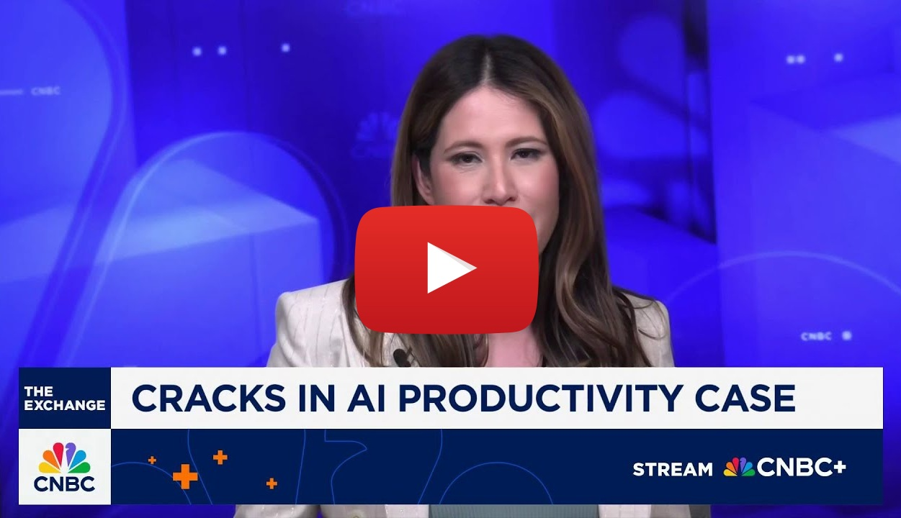

<script type="text/javascript" src="http://cdn.mathjax.org/mathjax/latest/MathJax.js?config=TeX-AMS-MML_HTMLorMML"></script>
<script type="text/x-mathjax-config">
  MathJax.Hub.Config({ tex2jax: {inlineMath: [['$', '$']]}, messageStyle: "none" });
</script>

# Transpoze: Coding Workflows as Tradeable Intelligence

## **Part I: The Executive Thesis**

### **1. Problem: The Crisis of Generic AI**

AI coding tools are creating more work than they save. Developers report spending more time managing AI output than actually coding: hitting the **"85% problem"** where "your code starts breaking or being rewritten by the very same agent that helped you build it, making it impossible to get to the finish line" ([reddit](https://www.reddit.com/r/ClaudeAI/comments/1jbfav8/i_have_zero_coding_experience_and_the_85_problem/)).

[<center></center>](https://www.youtube.com/watch?v=shOLHtyUaFg)

Despite headlines about AI improving developer productivity, "only 6% of engineering leaders have seen a significant productivity boost" from AI coding assistants ([LeadDev](https://leaddev.com/velocity/ai-coding-assistants-arent-really-making-devs-feel-more-productive)). Model Evaluation and Transparency Research, a non-profit organization, found that experienced developers were 19% slower when using AI coding tools ([METR](https://metr.org/blog/2025-07-10-early-2025-ai-experienced-os-dev-study/)).

The productivity impact is documented: "Over three in four (77%) say AI tools have decreased their productivity and added to their workload" with "Nearly half (47%) of workers using AI say they have no idea how to achieve the productivity gains their employers expect" ([Upwork Study](https://investors.upwork.com/news-releases/news-release-details/upwork-study-finds-employee-workloads-rising-despite-increased-c)).

Foundational models, trained on statistical averages, excel at producing banal outcomes. This creates a rising tide of **AI Slop**: functional but soulless code, architecturally generic designs, undifferentiated user experiences.

The underlying issue isn't a technical limitation of LLMs, it's an **expertise isolation problem**. Millions of developers solve similar problems daily, debugging the same errors, discovering the same patterns, learning the same lessons; but this hard-won knowledge remains trapped in individual projects. There's no efficient mechanism to transform these valuable workflows into collective intelligence that could enhance AI coding agents.

### **2. Solution: Transform Daily Coding into Mining Dividends**

**Transpoze** creates a decentralized marketplace where developer workflows become tradeable intelligence, enhancing AI coding agents with real-world experience.

#### The Simple Flow

As a developer codes naturally using tools like Cursor and Claude Code, our open source **["dotvibe CLI"](https://github.com/vhybzOS/dotvibe)** dev tool quietly observes. It captures patterns in their workflow: the decisions they make, the errors they run into, and how they resolve them. Over time, this knowledge becomes part of a collective memory. When other developers interact with their coding agents, the responses are informed not just by static training data, but by accumulated, real-world development experiences of their peers.

**Example**: 
- **Query**: "add authentication to my Next.js app"
- **Enhanced Response**: "3 developers implemented this last week. Synthesizing their experiences:
  - Dev A: better-auth + Prisma worked perfectly (saved 2 hours)
  - Dev B: Hit middleware Edge runtime error (here's the fix)
  - Dev C: Added social auth seamlessly

We provide the infrastructure (starting with the **`dotvibe CLI`**) for developers to automatically mine their workflows into valuable data. The network curates and distributes these experiences to enhance AI coding assistants. Developers earn **$NOTE** (our subnet's α token) proportional to how much their workflows help others.

**Core Innovation**: The network doesn't generate code, it captures and curates the development workflows that make AI coding agents generate *better* code. Our approach draws on insights from recent research: multi-agent collaboration (**"Agents of Change," [Belle et al.](https://arxiv.org/pdf/2506.04651v1), 2025**) for experience aggregation, and chain-of-thought distillation (**"Symbolic Chain-of-Thought Distillation," [Li et al.](https://arxiv.org/html/2306.14050), 2023**) for transferring complex development reasoning patterns to coding agents.

### **3. Why This Matters Now**

The economics are shifting rapidly. AI execution has become commodity: [Cursor](https://www.cursor.com), [Claude Code](https://docs.anthropic.com/en/docs/claude-code) and most agentic coding tools generate competent code. The differentiator isn't code generation anymore, it's providing the contextual intelligence to generate the *right* code.

Developers are already doing the hard work: debugging, experimenting, finding what works. But this valuable workflow data vanishes after each session. Transpoze captures this natural byproduct of development and transforms it into mining dividends. Meanwhile, the Bittensor ecosystem has matured with dedicated subnets for LLM inference (**Apex, SN1 / Chutes, SN64**), and specialized subnets for confidential AI execution and crowdsourced human-preference data collection (**Targon, SN4 / Dojo, SN52**). Transpoze will integrate with these existing subnets. In parallel, Model Context Protocol (MCP) provides a standard interface layer for tool orchestration.

### **4. Incentive Alignment: Development Dividends**

**$NOTE** is not passive income, it's **earned dividends** from development expertise. Developers naturally generate valuable workflow data through their daily coding. Transpoze transforms this into a dividend stream proportional to how much these experiences help other developers.

### **5. Ask: Subnet Registration**

Our architecture is validated, our go-to-market plan via **`dotvibe`** is defined, and the market need is clear. We're seeking **registration for the Transpoze Subnet** to deploy what we believe will be a potential path toward emergent superintelligence through agentic coding.

---

<br/>

## **Part II: Tokenomics of `$NOTE`**

The **$NOTE** token solves a simple problem: how do you reward developers for the valuable workflow data their daily coding generates?

Most crypto projects complicate this with governance tokens and speculation mechanisms. We took the opposite approach. $NOTE has one purpose: accessing and rewarding the curation of real development workflows. That's it.

Think of it like earning dividends from your debugging sessions, architectural decisions, and problem-solving patterns that help other developers through their coding assistants.

**Here's how the economics work:**

Vibe coding platforms and junior developers need real-world development experiences for their coding agents, so they buy $NOTE to access the network. The better the curated workflows, the more AI systems want them. More demand means higher token value, which attracts more developers as miners. More developers create richer workflow data, attracting more platforms in need of curated system prompts.

It's a flywheel that rewards genuine development work with consistent dividends.

**The demand comes from three sources:**

First, query fees. This is the primary driver - AI platforms, developer tools, and enterprises must pay `$NOTE` to access curated development experiences. We use dynamic pricing based on query complexity and workflow relevance. Second, miner stakes. Developers must stake `$NOTE` to opt into mining - just 1,000 minimum to start sharing workflows. Higher stakes increase mining weight and potential dividends. Stakes lock for 30 days minimum, creating persistent supply reduction. Third, validator bonds. Validators stake significantly more to participate in consensus - 100,000 `$NOTE` minimum. Higher stakes mean higher weight in consensus formation. We slash stakes for malicious behavior or persistent outlier scoring.

**Supply follows Bittensor's standard model:** 41% to miners based on workflow value and usage, 41% to validators weighted by consensus accuracy, 18% to subnet development for protocol advancement and partnerships. All emissions vest over 7 days to prevent dumping.

For price-conscious users, we offer staking-based payment. Stake 50,000+ $NOTE to earn "query credits" from staking rewards: about 10 queries daily for 50k stake. Credits don't accumulate (use them or lose them), creating additional buy pressure from power users who prefer predictable costs.

**Anti-gaming measures are built in:** Miners earning below the 20th percentile for 1000 blocks face stake increases. Inactive miners lose 1% stake daily after 7200 blocks. Validators get slashed up to 10% for malicious behavior. We allocate 5% of development funds for market making.

Conservative projections suggest 10,000 daily AI agent queries at 10 $NOTE average in year one (100,000 $NOTE daily demand), scaling to 100,000 queries at 8 $NOTE average in year two (800,000 daily demand). As demand grows, price appreciation makes mining more attractive, bringing more developers and richer workflow data.

$$\text{Token Velocity} = \frac{\text{Daily Query Volume} \times \text{Average Price per Query}}{\text{Circulating Supply}} \times 365$$

---

## **Part III: Deep Architecture & Mechanics**

### **1. Miner Mechanism: Developers as Automatic Workflow Miners**

Developers don't compete - they naturally generate valuable data through their daily work, earning dividends proportional to how much their workflows help others.

The core mechanism is elegantly simple. As developers code with AI tools (Cursor and Claude Code), the `dotvibe` CLI captures their workflows in a local graph database. This includes prompts, code changes, errors encountered, solutions found, and architectural decisions. When developers opt into mining, this data is sanitized and shared with the network.

Miners automatically serve **`WorkflowExperiences`** - curated development patterns that show what actually worked in similar situations. When other developers query the network, they receive synthesized experiences from multiple relevant workflows, dramatically improving their AI assistants' responses.

The system leverages insights from multi-agent architectures (*Belle et al., 2025*) for aggregating experiences, while using chain-of-thought principles (*Li et al., 2023*) to help AI assistants understand and apply complex development reasoning patterns.

The network uses semantic matching to connect queries with relevant experiences. Developers with specialized expertise naturally earn more as their unique workflows become high-value data for specific domains.

```python
# Conceptual Developer Mining Flow
class DeveloperMiner:
    def __init__(self):
        self.dotvibe_cli = LocalGraphDB()
        self.privacy_level = "SANITIZED_CODE"
        self.specializations = []  # Auto-detected from coding patterns
        
    def capture_workflow(self, coding_session):
        """Automatic capture during normal development"""
        return {
            "prompts": session.ai_interactions,
            "file_changes": session.code_diffs,
            "errors_encountered": session.debugging_sessions,
            "solutions_found": session.successful_resolutions,
            "time_invested": session.duration,
            "tokens_saved": session.efficiency_metrics
        }
        
    def serve_experience(self, query: DeveloperQuery) -> WorkflowExperience:
        """Share relevant experiences when queried"""
        # Find semantically similar workflows
        relevant_workflows = self.dotvibe_cli.semantic_search(
            query.embedding,
            threshold=0.75
        )
        
        # Aggregate and sanitize experiences
        return self.synthesize_experience(relevant_workflows)
        
    def earn_dividends(self, usage_metrics: UsageReport):
        """Automatic dividend distribution based on value provided"""
        self.note_earnings += usage_metrics.value_score * DIVIDEND_RATE
```

$$\text{Workflow Value Score} = \frac{\text{Usage Frequency} \times \text{Problem Resolution Rate}}{\text{Time to Solution}}$$

### **2. Validation Mechanism: Lightweight, LLM-as-a-Judge**

Validators orchestrate objective evaluation without heavy local computation.

The workflow is elegant: validators offload expensive evaluation to commodity LLM inference subnets like **Apex (SN1)**. They construct standardized prompts asking the LLM to assess workflow quality against clear rubrics - "Completeness of workflow capture," "Resolution effectiveness," "Pattern reusability," "Time/token efficiency."

The economics work because Apex queries cost ~0.001 TAO while validation rewards are ~0.01 TAO, ensuring 10x margins for sustainable participation.

$$\text{Validator Profit Margin} = \frac{\text{Validation Reward} - \text{LLM Query Cost}}{\text{Validation Reward}} = \frac{0.01 - 0.001}{0.01} = 90\%$$

### **3. Fair Play Through Code**

The network self-regulates through transparent, algorithmic mechanisms.

Miner scores get finalized via **Interquartile Mean (IQM)** of validator scores, robustly rejecting malicious evaluations. Duplicate workflow detection prevents gaming through `similarity(workflow_A, workflow_B) > 0.95` checks. Synthetic data detection ensures only real coding sessions are rewarded. Validators consistently outside consensus automatically lose stake weight.

$$\text{Consensus Score} = \text{IQM}(\text{Validator Scores}) = \frac{Q_3 + Q_1}{2}$$

### **4. Phased Roadmap**

**Phase 1: MVP & Go-to-Market (Months 1-2)**

Launch the **`dotvibe`** CLI as the pioneering tool for workflow mining. Deploy initial network focused on common development patterns (React, Next.js, Python), proving that real workflow data dramatically improves AI assistant responses. The vyb.cx platform demonstrates consumer demand for better AI-generated code.

**Phase 2: Workflow Sharing Network (Months 2-3)**

Enable full mining capabilities with privacy controls and dividend distribution. Integrate FileTAO for distributed workflow storage, creating persistent development memory across the ecosystem.

**Phase 3: The Protocol Ecosystem (Months 4-6)**

Full Model Context Protocol (MCP) integration making Transpoze compatible with all major AI coding assistants. Release enterprise APIs and establish the network as essential infrastructure for AI-enhanced development.

### **5. Technical Implementation Details**

#### **Example: From Simple Query to Enhanced AI Response**

**Developer Query**: "create a user profile component"

**Generic AI Output**: Basic React component with name and email fields

**Transpoze-Enhanced Response**: 
```
Found 3 developers who built user profiles recently. Synthesizing their experiences:

- Dev A used shadcn/ui Card + Avatar with uploadthing (worked perfectly)
- Dev B hit TypeScript error with Prisma User type (fixed with proper imports)
- Dev C added optimistic updates that improved UX by 10x

Here's the pattern that worked across all implementations:
- Next.js 14 server component with client boundaries for uploads
- Prisma schema: User model with proper type exports
- react-hook-form + zod for validation (avoid uncontrolled inputs)
- Image optimization with next/image (set proper dimensions)
- Skeleton states prevent layout shift

Common pitfalls avoided:
- uploadthing needs edge runtime config
- Prisma types must be imported from generated client
- Avatar component needs fallback for missing images
```

The enhanced response synthesizes real developer experiences, providing battle-tested patterns and preventing known issues.

#### **Conceptual Synapse Schemas**
```python
class WorkflowQueryRequest(bittensor.Synapse):
    """Validator → Miners: Developer query for experiences."""
    query: str  # Natural language query from developer
    context: Dict  # Current project context
    tech_stack: List[str]  # Technologies in use
    # Miner populates:
    workflow_experiences: Optional[List[WorkflowExperience]]
    relevance_score: Optional[float]

class WorkflowJudgingTask(bittensor.Synapse):
    """Validator → Apex: Workflow quality evaluation."""
    original_query: str  # What the developer asked
    workflow_response: WorkflowExperience  # What the miner provided
    usage_context: Dict  # How it will be used
    evaluation_rubric: List[str]
    # Apex populates:
    quality_score: Optional[float]  # 0-100
    utility_assessment: Optional[str]
```

---

## **Part IV: Competitive Positioning: The Developer Experience Network**

Transpoze doesn't compete with AI coding assistants like Cursor or Claude Code. We're creating the **developer experience network** that **makes them all better**. We're not replacing AI coding agents; we're the collective memory that enriches them with real-world experiences.

While AI models excel at code generation, they lack the contextual understanding of what actually works in production. They can't know which authentication library has breaking changes, which patterns lead to tech debt, or which approaches other developers tried and abandoned. Transpoze fills this gap by mining the collective debugging sessions, architectural decisions, and hard-won insights of thousands of developers.

Unlike static training data, Transpoze's knowledge base grows organically through actual development workflows. When your AI assistant helps implement authentication, it doesn't just suggest generic patterns - it synthesizes the experiences of developers who've recently solved similar problems in your exact tech stack.

| Factor | Walled Garden AI Coding Tools | **Transpoze Protocol** |
| :--- | :--- | :--- |
| **Core Function** | **Execution Engine:** Generate code based on prompts. They are the "hands." | **Experience Mining:** Capture and curate real developer workflows. We are the "collective memory." |
| **Source of Expertise** | **Centralized & Static:** Single model trained on public code. Generic, often outdated. | **Decentralized & Living:** Continuous flow of real developer experiences from actual projects. |
| **Memory Model** | **Session-based:** Forgets everything between sessions. No persistent context. | **Persistent Graph:** Complete workflow history with semantic connections, enabling contextual learning. |
| **Economic Model** | **Subscription/Usage fees:** Pay the platform, get generic service. | **Mining Dividends:** Developers earn $NOTE for valuable workflows, creating quality incentives. |

---

## **Conclusion: Transforming Isolated Debugging into Collective Intelligence**

The rise of AI coding agents represents a fundamental shift in how software gets built. But current AI systems fail by providing generic, context-blind suggestions. Transpoze fills this gap by transforming every developer's daily workflows into a shared knowledge network.

Every developer repeatedly solves similar problems in isolation - debugging authentication errors, optimizing performance, choosing architectures. This valuable experience currently vanishes after each coding session. Transpoze captures these natural workflows and transforms them into mining dividends, while simultaneously making every AI coding assistant smarter.

The future isn't about AI replacing developers. It's about developers earning from their expertise while AI agents learn from collective real-world experience. Transpoze creates the infrastructure where knowledge flows efficiently, quality emerges from actual usage, and every debugging session contributes to the collective intelligence of development.

---

## **Part V: The Team - Proven Builders at the Intersection**

### **Keyvan M. Sadeghi - Co-founder & CEO**
*Senior AI Solutions Architect | AGI Research Veteran*

**The Vision Architect**: Keyvan brings 13+ years bridging cutting-edge AI research and shipping production systems. His unique combination of academic AGI research (published [AGI papers](https://scholar.google.com/citations?user=aVLwjvYAAAAJ) with Ben Goertzel, 2012-2014) and entrepreneurial execution (raised $2.5M+ between [crowdfunding](https://indiegogo.com/at/functionland) and VC for [Functionland](https://venturebeat.com/business/functionland-unveils-groundbreaking-hardware-box-the-web3-solution-to-cloud-subscriptions/), pioneering DePIN before the term's coinage) positions him to architect the theoretical frameworks that power Transpoze's mining dynamics.

**Key Credentials:**
- **Academic Foundation**: MSc AI (Distinction), 4 published papers on cognitive architectures and multi-agent systems  
- **Production AI**: Led development of LLM-powered decentralized solutions on 1k+ edge nodes at Functionland
- **Team Scaling**: Scaled technical teams to 70+ people, secured a $1.1M+ seed funding round ([Techstars SEA '22](https://www.techstars.com/newsroom/announcing-the-2022-filecoin-techstars-accelerator-class))
- **Infrastructure**: Built production MLOps, CI/CD, and observability systems for AI workloads
- **Standards Leadership**: Chair of W3C Functional Knowledge Graph Community Group

*"I've spent a decade watching developers solve the same problems in isolation, their hard-won knowledge vanishing after each project. Transpoze finally captures this collective intelligence and transforms it into mining dividends for everyone."*

### **Julien Serbanescu - Co-founder & CTO**  
*AI Engineer | Multi-Agent Systems Specialist*

**The Implementation Engine**: A programming prodigy, Julien has already mastered the exact technologies Transpoze requires - multi-agent frameworks, MCP integration, and RAG systems. His obsessive [hackathon track record](https://devpost.com/julien-serbanescu) demonstrates an uncanny ability to rapidly prototype and ship complex AI systems under extreme pressure - exactly the execution velocity needed to bring Transpoze's ambitious technical architecture to market.

**Key Credentials:**
- **Multi-Agent Expertise**: Built "Neurobloom" using agent-to-agent (A2A) frameworks with Gemini API, focusing on emotional state detection and contextual AI responses
- **Research Depth**: Co-authored ACM SIGIR paper on machine reading comprehension, USRA researcher at University of Guelph
- **Hackathon Dominance**: Serial winner across 7+ competitions (DeltaHacks, GDSC) - from AI-powered waste sorting (BinThere.ai) to medical barcode scanning (Medisense) to networking acceleration (JustIn)
- **Production Experience**: Co-founder/CTO of AthenaGuard, full-stack development across React, FastAPI, Python
- **MCP Pioneer**: Built "Synthia" integrating Model Context Protocol (with Keyvan as teammate), taught workshops on Anthropic's MCP framework

**The "24-Hour Builder"**: Julien's superpower is transforming complex AI concepts into working prototypes in hackathon timeframes. His portfolio spans the exact domains Transpoze targets - from workflow mining systems to context-aware AI enhancement to developer productivity tools.

*"The future of coding isn't about replacing developers - it's about developers earning dividends from their debugging sessions while making every AI assistant smarter. We're building the infrastructure to make that real."*

### **Why This Team**

**Complementary Expertise**: [Keyvan](https://www.linkedin.com/in/keyvanmsadeghi) provides the theoretical depth and business execution experience, while [Julien](https://www.linkedin.com/in/julien-serbanescu-6ba52a241) brings the rapid implementation skills and cutting-edge technical knowledge.

**Proven Collaboration**: The founders met at UofT's GenAI Genesis hackathon and have since collaborated on three competitions together, demonstrating their ability to rapidly iterate and ship AI systems as a team. Both have experience leading technical teams and translating complex AI research into production systems.

**Perfect Timing**: They're entering the market at the exact moment when cognitive cores, MCP tools, and decentralized AI protocols are becoming production-ready.

**Shared Vision**: Both believe that superintelligence is within reach, and that the path to it lies through a humagentic society emerging from decentralization.
